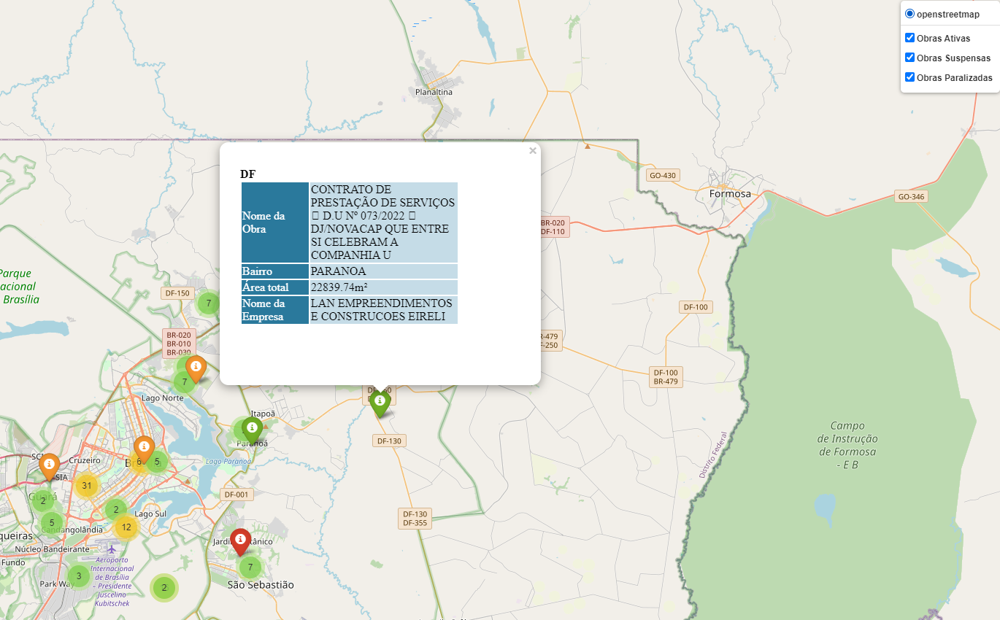

# Obras Públicas

## Sobre 
Este projeto consiste em tratar os dados de obras públicas e apresentar os dados em um mapa, quem deseja abrir algum comércio com foco em obras poderá consultar o mapa para verificar quais obras estão paradas ou funcionando para decidir onde montar o seu négocio.

## Requisitos
Python 3.9.0

<br>

## Como Rodar
### Executando com Python
```
pip install -r requirements.txt
```
```
python gera_mapa.py
```

<br>

## Exemplo




